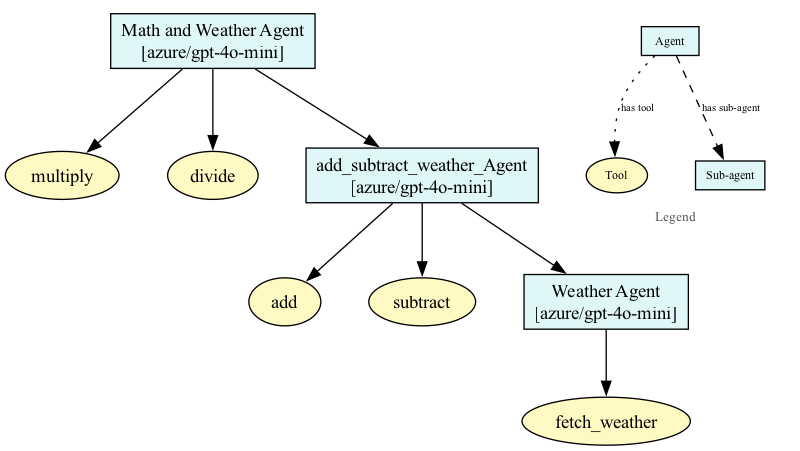

# Sub-Agents in Thinagents

Sub-agents are a powerful concept in the `thinagents` library, allowing you to compose complex agent behaviors by delegating tasks to specialized sub-agents. This modular approach enables you to build hierarchical, collaborative, and highly capable AI systems.

## What are Sub-Agents?

A sub-agent is an agent that is managed by another agent (the parent agent). The parent agent can delegate specific tasks to its sub-agents, each of which may have its own tools, instructions, and even further sub-agents. This structure allows for clear separation of concerns and more maintainable code.

## Why Use Sub-Agents?

- **Modularity:** Break down complex tasks into smaller, manageable components.
- **Specialization:** Assign specific responsibilities to different agents (e.g., math, weather, search).
- **Reusability:** Reuse sub-agents across different parent agents or workflows.

## Example: Math and Weather Agents

Let's walk through an example where we want an agent to handle both math operations and weather queries. We'll use sub-agents to organize this logic.

### Step 1: Define Tools

```python
from thinagents import Agent
from pydantic import BaseModel
import requests

def add(a: float, b: float) -> float:
    return a + b

def subtract(a: float, b: float) -> float:
    return a - b

def multiply(a: float, b: float) -> float:
    return a * b

def divide(a: float, b: float) -> float:
    return a / b


def fetch_weather(city: str) -> dict:
    api_key = "YOUR_OPENWEATHER_API_KEY"
    base_url = "http://api.openweathermap.org/data/2.5/weather"
    params = {"q": city, "appid": api_key, "units": "metric"}
    try:
        response = requests.get(base_url, params=params)
        response.raise_for_status()
        weather_data = response.json()
        return {
            "temperature": weather_data["main"]["temp"],
            "feels_like": weather_data["main"]["feels_like"],
            "humidity": weather_data["main"]["humidity"],
            "description": weather_data["weather"][0]["description"],
            "wind_speed": weather_data["wind"]["speed"]
        }
    except Exception as e:
        return {"error": str(e)}
```

### Step 2: Define Output Models

```python
from pydantic import Field

class Output(BaseModel):
    weather: str
    math: str

class WeatherOutput(BaseModel):
    weather: str
```

### Step 3: Create Sub-Agents

```python
w_agent = Agent(
    name="Weather-Agent",
    model="openai/gpt-4o-mini",
    description="Weather Agent -- Used to fetch weather data for a given city",
    tools=[fetch_weather],
)

add_subtract_weather_Agent = Agent(
    name="add subtract weather agent",
    model="openai/gpt-4o-mini",
    description="Math Agent for addition/subtraction with weather sub-agent",
    sub_agents=[w_agent],
    tools=[add, subtract],
)
```

### Step 4: Compose the Main Agent

```python
agent = Agent(
    name="Math and Weather Agent",
    model="openai/gpt-4o-mini",
    tools=[multiply, divide],
    sub_agents=[add_subtract_weather_Agent],
    response_format=Output,
)
```

<Callout title="Note">
  When using sub-agents, you want to add description to the sub-agents so that the main agent can use it.
</Callout>

### Step 5: Run the Agent

```python
from thinagents.core.response_models import ThinagentResponse

res: ThinagentResponse[Output] = agent.run(
    "what is the sum of 2 and 3, along with that find the weather in Hyderabad, India"
)

print(res.content.math)
print(res.content.weather)
```

**Output:**

```
The sum of 2 and 3 is 5.
The current weather in Hyderabad, India is as follows:
- Temperature: 30.3°C (Feels like 33.8°C)
- Conditions: Overcast clouds
- Humidity: 62%
- Wind Speed: 6.0 m/s
```

## Visualizing Agent Hierarchies

The `thinagents` library also provides utilities to visualize agent and sub-agent relationships.

```python
from thinagents.utils.visualize import visualize_agent_flow

visualize_agent_flow(agent)
```

This will generate a diagram showing the parent agent, its sub-agents, and their tools.



## Conclusion

Sub-agents in `thinagents` enable you to build scalable, modular, and collaborative AI systems. By composing agents hierarchically, you can tackle complex workflows with clarity and maintainability.
